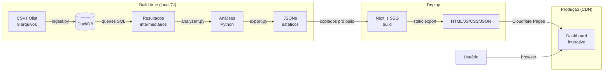
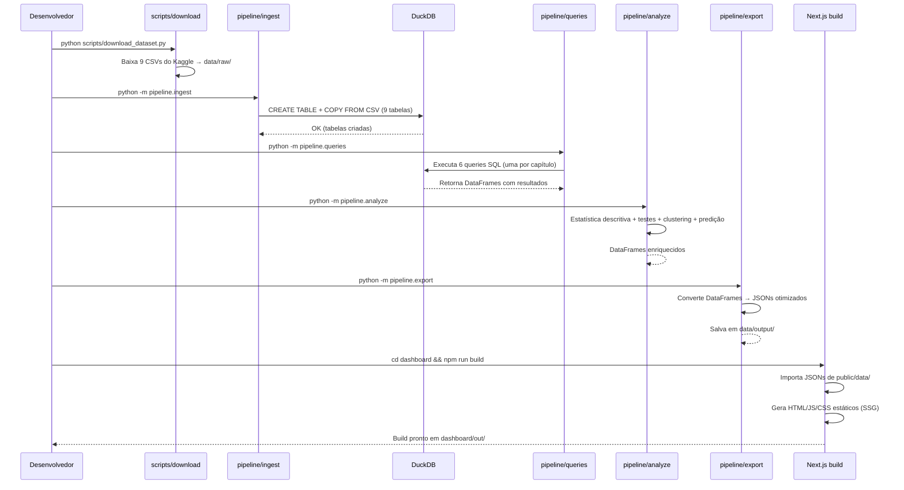
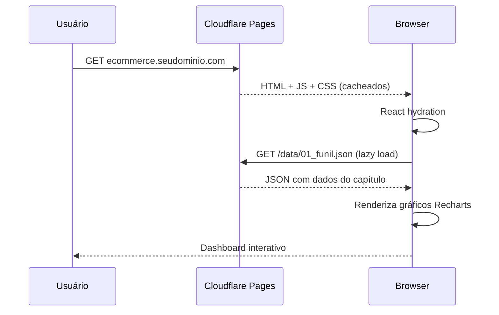
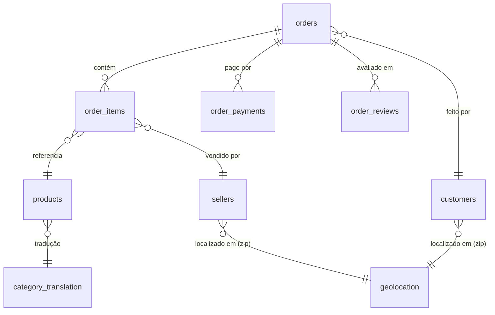
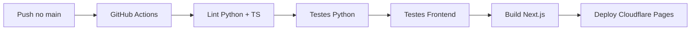

# ARCHITECTURE.md — Raio-X do E-commerce Brasileiro

**Versão:** 1.0
**Última atualização:** 16 de março de 2026

---

## 1. Visão Geral

O sistema é um pipeline de dados offline que transforma 9 CSVs do dataset Olist em um dashboard interativo estático. O fluxo é unidirecional: dados brutos (CSVs) são importados para um banco DuckDB local, processados por queries SQL e scripts Python, exportados como JSONs estáticos, e consumidos por um dashboard Next.js que é gerado como site estático (SSG) e servido via CDN.

Não existe backend em produção. Não existe banco de dados em produção. Todo processamento acontece no build-time (máquina do desenvolvedor ou CI). O site final é um conjunto de arquivos HTML/JS/CSS/JSON servidos pelo Cloudflare Pages.

**Tipo de arquitetura:** Pipeline offline + Site estático (SSG)

### Diagrama geral

---

## 2. Componentes

### 2.1 Pipeline de Ingestão

| Aspecto | Detalhe |
|---------|---------|
| **Responsabilidade** | Importar os 9 CSVs do Olist para tabelas no DuckDB com tipos corretos |
| **Tecnologia** | Python + DuckDB |
| **Localização no código** | `pipeline/ingest.py` |
| **Entrada** | `data/raw/*.csv` (9 arquivos) |
| **Saída** | `data/processed/olist.duckdb` (banco com 9 tabelas) |
| **Validações** | Verifica se todos os 9 CSVs existem, valida contagem de linhas, verifica tipos |

### 2.2 Queries SQL

| Aspecto | Detalhe |
|---------|---------|
| **Responsabilidade** | Executar as análises SQL e gerar resultados intermediários por capítulo |
| **Tecnologia** | SQL (DuckDB dialect, muito próximo de PostgreSQL) |
| **Localização no código** | `pipeline/queries/*.sql` (execução) + `sql/*.sql` (showcase documentado) |
| **Entrada** | Tabelas no DuckDB |
| **Saída** | DataFrames pandas com resultados por capítulo |
| **Técnicas demonstradas** | JOINs multi-tabela, CTEs, Window Functions (ROW_NUMBER, LAG, LEAD, NTILE, PERCENT_RANK), CASE WHEN, agregações condicionais, date functions, subqueries correlacionadas |

### 2.3 Análises Python

| Aspecto | Detalhe |
|---------|---------|
| **Responsabilidade** | Executar análises estatísticas e ML sobre os resultados das queries |
| **Tecnologia** | Python (pandas, scipy, scikit-learn) |
| **Localização no código** | `pipeline/analyze/` |
| **Entrada** | DataFrames dos resultados SQL |
| **Saída** | DataFrames enriquecidos com scores, clusters, predições, métricas |

#### Análises por módulo:

| Módulo | O que faz | Técnicas |
|--------|-----------|----------|
| `descritiva.py` | Distribuições, outliers, correlações | IQR, Z-score, Pearson, Spearman |
| `hipoteses.py` | Testes de significância estatística | t-test independente, Mann-Whitney U, chi-quadrado |
| `clustering.py` | Segmentação automática de clientes | K-Means, Elbow method, Silhouette score |
| `predicao.py` | Modelo preditivo de atraso de entrega | Logistic Regression, Random Forest, métricas (accuracy, precision, recall, F1, AUC-ROC) |

### 2.4 Exportação de JSONs

| Aspecto | Detalhe |
|---------|---------|
| **Responsabilidade** | Converter resultados das análises em JSONs otimizados pro dashboard |
| **Tecnologia** | Python (pandas + json) |
| **Localização no código** | `pipeline/export.py` |
| **Entrada** | DataFrames processados |
| **Saída** | `data/output/*.json` (um ou mais JSONs por capítulo) |
| **Otimizações** | Valores numéricos arredondados (2 casas), campos desnecessários removidos, estrutura otimizada pra consumo frontend |

### 2.5 Dashboard Next.js

| Aspecto | Detalhe |
|---------|---------|
| **Responsabilidade** | Renderizar os dados processados como dashboard interativo com narrativa editorial |
| **Tecnologia** | Next.js 14 (App Router) + TypeScript + Recharts + Tailwind CSS |
| **Localização no código** | `dashboard/` |
| **Entrada** | JSONs estáticos em `public/data/` |
| **Saída** | Site estático (output: 'export') |
| **Estado** | React state local (sem estado global — cada página carrega seus JSONs) |
| **Roteamento** | File-based (App Router): `/`, `/funil`, `/rfm`, `/cohort`, `/geografico`, `/sazonalidade`, `/reviews` |

---

## 3. Fluxo de Dados

### Fluxo principal — Pipeline de build (executado uma vez)

### Fluxo de produção — Usuário acessa o dashboard

---

## 4. Modelo de Dados

### 4.1 Tabelas do Dataset Olist (importadas pro DuckDB)

O dataset tem 9 tabelas com relacionamentos definidos. O Claude Code importa os CSVs mantendo a estrutura original.

### Diagrama de relacionamentos

### Tabelas detalhadas

#### orders (tabela central)

Cada registro é um pedido. Esta é a tabela principal que conecta todas as outras.

| Coluna | Tipo | Descrição |
|--------|------|-----------|
| order_id | VARCHAR | PK — Identificador único do pedido |
| customer_id | VARCHAR | FK → customers — Cliente que fez o pedido |
| order_status | VARCHAR | Status: delivered, shipped, canceled, etc. |
| order_purchase_timestamp | TIMESTAMP | Data/hora da compra |
| order_approved_at | TIMESTAMP | Data/hora da aprovação do pagamento |
| order_delivered_carrier_date | TIMESTAMP | Data/hora de entrega à transportadora |
| order_delivered_customer_date | TIMESTAMP | Data/hora de entrega ao cliente |
| order_estimated_delivery_date | TIMESTAMP | Data estimada de entrega |

**Registros:** ~99.441
**Status possíveis:** delivered, shipped, canceled, unavailable, invoiced, processing, created, approved

#### order_items

Itens dentro de cada pedido. Um pedido pode ter múltiplos itens.

| Coluna | Tipo | Descrição |
|--------|------|-----------|
| order_id | VARCHAR | FK → orders |
| order_item_id | INTEGER | Número sequencial do item no pedido (1, 2, 3...) |
| product_id | VARCHAR | FK → products |
| seller_id | VARCHAR | FK → sellers |
| shipping_limit_date | TIMESTAMP | Data limite pra envio |
| price | DECIMAL | Preço do item (BRL) |
| freight_value | DECIMAL | Valor do frete do item (BRL) |

**Registros:** ~112.650

#### order_payments

Pagamentos de cada pedido. Um pedido pode ter múltiplas formas de pagamento.

| Coluna | Tipo | Descrição |
|--------|------|-----------|
| order_id | VARCHAR | FK → orders |
| payment_sequential | INTEGER | Sequência do pagamento (1, 2...) |
| payment_type | VARCHAR | Tipo: credit_card, boleto, voucher, debit_card |
| payment_installments | INTEGER | Número de parcelas |
| payment_value | DECIMAL | Valor pago (BRL) |

**Registros:** ~103.886

#### order_reviews

Avaliações dos clientes. Uma review por pedido.

| Coluna | Tipo | Descrição |
|--------|------|-----------|
| review_id | VARCHAR | PK — ID da review |
| order_id | VARCHAR | FK → orders |
| review_score | INTEGER | Nota de 1 a 5 |
| review_comment_title | VARCHAR | Título do comentário (pode ser NULL) |
| review_comment_message | VARCHAR | Texto do comentário (pode ser NULL) |
| review_creation_date | TIMESTAMP | Data de criação da review |
| review_answer_timestamp | TIMESTAMP | Data de resposta do vendedor |

**Registros:** ~99.224

#### customers

Clientes. Cada order_id tem um customer_id único, mas customer_unique_id identifica recompra.

| Coluna | Tipo | Descrição |
|--------|------|-----------|
| customer_id | VARCHAR | PK — ID do cliente (único por pedido) |
| customer_unique_id | VARCHAR | ID real do cliente (permite identificar recompra) |
| customer_zip_code_prefix | VARCHAR | CEP (5 dígitos) |
| customer_city | VARCHAR | Cidade |
| customer_state | VARCHAR | UF (2 letras) |

**Registros:** ~99.441
**Nota crítica:** `customer_id` é único por pedido. Para análises de recompra (RFM, Cohort), usar `customer_unique_id`.

#### products

Catálogo de produtos.

| Coluna | Tipo | Descrição |
|--------|------|-----------|
| product_id | VARCHAR | PK — ID do produto |
| product_category_name | VARCHAR | Categoria em português |
| product_name_length | INTEGER | Comprimento do nome |
| product_description_length | INTEGER | Comprimento da descrição |
| product_photos_qty | INTEGER | Quantidade de fotos |
| product_weight_g | INTEGER | Peso em gramas |
| product_length_cm | INTEGER | Comprimento em cm |
| product_height_cm | INTEGER | Altura em cm |
| product_width_cm | INTEGER | Largura em cm |

**Registros:** ~32.951

#### sellers

Vendedores do marketplace.

| Coluna | Tipo | Descrição |
|--------|------|-----------|
| seller_id | VARCHAR | PK — ID do vendedor |
| seller_zip_code_prefix | VARCHAR | CEP (5 dígitos) |
| seller_city | VARCHAR | Cidade |
| seller_state | VARCHAR | UF (2 letras) |

**Registros:** ~3.095

#### geolocation

Geolocalização por CEP. Múltiplas coordenadas por CEP (centróides de bairros).

| Coluna | Tipo | Descrição |
|--------|------|-----------|
| geolocation_zip_code_prefix | VARCHAR | CEP (5 dígitos) |
| geolocation_lat | DOUBLE | Latitude |
| geolocation_lng | DOUBLE | Longitude |
| geolocation_city | VARCHAR | Cidade |
| geolocation_state | VARCHAR | UF (2 letras) |

**Registros:** ~1.000.163
**Nota:** Muitos registros por CEP. Para uso em JOINs, agregar com AVG(lat), AVG(lng) por zip_code_prefix ou usar DISTINCT.

#### product_category_name_translation

Tradução dos nomes de categoria de português pra inglês.

| Coluna | Tipo | Descrição |
|--------|------|-----------|
| product_category_name | VARCHAR | Nome em português (PK) |
| product_category_name_english | VARCHAR | Nome em inglês |

**Registros:** 71
**Nota:** 3 categorias do dataset não têm tradução (pc_gamer, portateis_cozinha_e_preparadores_de_alimentos, NULL). Tratar no pipeline.

---

## 5. Capítulos Analíticos — Especificação Técnica

### Cap. 1 — Funil de Vendas

**Objetivo:** Mapear as etapas do pedido e identificar onde ocorrem perdas.

**Técnicas SQL:** Agregações condicionais (COUNT + CASE WHEN), date diff entre timestamps, CTEs.

**Dados de entrada:** orders (status + timestamps)

**Métricas geradas:**
- Contagem de pedidos por status (barras)
- Taxa de conversão entre etapas: compra → aprovação → envio → entrega
- Tempo médio entre cada etapa (em dias)
- Taxa de cancelamento por etapa
- Distribuição do tempo de entrega (histograma)

**Análise estatística:** Descritiva (distribuição do tempo de entrega, outliers de prazo)

**JSONs de saída:**
- `01_funil_status.json` — contagem por status
- `01_funil_conversao.json` — taxas entre etapas
- `01_funil_tempos.json` — distribuição de tempos

---

### Cap. 2 — RFM Segmentation

**Objetivo:** Segmentar clientes por valor usando Recency, Frequency, Monetary.

**Técnicas SQL:** Window Functions (NTILE pra quartis), agregações por customer_unique_id, date diff.

**Dados de entrada:** orders + order_items + customers (usando customer_unique_id)

**Métricas geradas:**
- R (dias desde última compra), F (número de pedidos), M (valor total gasto)
- Score RFM (1-5 por dimensão via NTILE)
- Segmentos nomeados: Champions, Loyal, At Risk, Lost, etc.
- Distribuição dos segmentos (treemap ou barras)
- Perfil médio de cada segmento

**Análise estatística:**
- Clustering: K-Means sobre (R, F, M) normalizados — comparar segmentação manual vs automática
- Elbow method e Silhouette score pra determinar k ótimo
- Correlação entre dimensões RFM

**JSONs de saída:**
- `02_rfm_distribuicao.json` — histogramas de R, F, M
- `02_rfm_segmentos.json` — contagem e perfil por segmento
- `02_rfm_clustering.json` — resultados do K-Means (centroids, labels)

---

### Cap. 3 — Cohort Analysis

**Objetivo:** Analisar retenção de clientes por coorte de primeira compra.

**Técnicas SQL:** CTEs encadeadas, Window Functions (MIN pra primeira compra, DENSE_RANK pra mês da coorte), self-join, agregações por coorte+período.

**Dados de entrada:** orders + customers (customer_unique_id)

**Métricas geradas:**
- Coorte mensal (mês da primeira compra)
- Taxa de retenção por coorte em meses subsequentes (heatmap)
- Taxa geral de recompra
- Tempo médio até segunda compra

**Nota importante:** Marketplace tem retenção naturalmente baixa. O insight é justamente documentar isso e quantificar.

**JSONs de saída:**
- `03_cohort_heatmap.json` — matriz coorte × período com taxas de retenção
- `03_cohort_recompra.json` — métricas gerais de recompra

---

### Cap. 4 — Análise Geográfica

**Objetivo:** Mapear performance por estado/região e identificar padrões geográficos.

**Técnicas SQL:** JOINs multi-tabela (orders + customers + sellers + geolocation + reviews), agregações por UF, subqueries.

**Dados de entrada:** Todas as tabelas (análise mais ampla)

**Métricas geradas:**
- Pedidos, receita, ticket médio por estado
- Frete médio por estado (absoluto e % do pedido)
- Review score médio por estado
- Concentração de vendedores vs clientes por estado
- Top categorias por região

**Análise estatística:**
- Correlação frete vs review score por UF (Spearman)
- Teste de hipótese: "estados com frete acima da mediana têm review score significativamente menor?" (Mann-Whitney U)

**Visualização:** Mapa interativo do Brasil via Leaflet (react-leaflet) com GeoJSON dos estados. Choropleth map colorido por métrica selecionada (receita, frete, score). Hover mostra detalhes do estado. Tile layer: CartoDB Positron (light, clean). Componente carregado via dynamic import (Leaflet não suporta SSR).

**JSONs de saída:**
- `04_geo_estados.json` — métricas agregadas por UF
- `04_geo_correlacao.json` — dados de correlação frete × satisfação
- `04_geo_categorias.json` — top categorias por região

---

### Cap. 5 — Sazonalidade

**Objetivo:** Identificar padrões temporais de vendas e receita.

**Técnicas SQL:** Date functions (EXTRACT, DATE_TRUNC), agregações por mês/dia da semana/hora, window functions (média móvel, YoY).

**Dados de entrada:** orders + order_items

**Métricas geradas:**
- Pedidos e receita por mês (série temporal)
- Média móvel de 3 meses
- Sazonalidade por dia da semana
- Sazonalidade por hora do dia
- Identificação de picos (Black Friday, Natal)
- Comparação mês a mês (MoM growth)

**Análise estatística:** Decomposição sazonal (trend + seasonal + residual) via statsmodels (seasonal_decompose, modelo aditivo).

**JSONs de saída:**
- `05_sazonalidade_mensal.json` — série temporal mensal com média móvel
- `05_sazonalidade_semanal.json` — padrão por dia da semana
- `05_sazonalidade_horaria.json` — padrão por hora do dia

---

### Cap. 6 — Reviews e Satisfação

**Objetivo:** Analisar drivers de satisfação e insatisfação.

**Técnicas SQL:** JOINs com aggregation, CASE WHEN para faixas, subqueries correlacionadas, string functions.

**Dados de entrada:** order_reviews + orders + order_items + products + sellers

**Métricas geradas:**
- Distribuição de scores (1-5)
- NPS (% promotores − % detratores, onde 5 = promotor, 1-3 = detrator, 4 = neutro)
- Score médio por categoria de produto
- Correlação: atraso na entrega → review score
- % de reviews com comentário vs sem
- Palavras mais frequentes em reviews 1-2 vs 4-5 (word frequency, não NLP avançado)

**Análise estatística:**
- Teste de hipótese: "pedidos entregues com atraso têm review score significativamente menor?" (Mann-Whitney U)
- Correlação Spearman entre dias de atraso e review score

**JSONs de saída:**
- `06_reviews_distribuicao.json` — histograma de scores
- `06_reviews_categorias.json` — score médio por categoria
- `06_reviews_atraso.json` — relação atraso × score
- `06_reviews_palavras.json` — palavras frequentes por faixa de score

---

## 6. Integrações Externas

### Kaggle Dataset

| Aspecto | Detalhe |
|---------|---------|
| **URL** | https://www.kaggle.com/datasets/olistbr/brazilian-ecommerce |
| **Tipo** | Download one-time (9 CSVs, ~45MB total) |
| **Autenticação** | Kaggle API key (opcional — pode baixar manualmente) |
| **Formato** | CSV (separador vírgula, encoding UTF-8) |
| **Atualização** | Não atualiza — dataset estático de 2016-2018 |

### Cloudflare Pages

| Aspecto | Detalhe |
|---------|---------|
| **Tipo** | Hospedagem de site estático |
| **Deploy** | Push no branch `main` → build automático |
| **Domínio** | Subdomain do domínio existente (DNS CNAME) |
| **Build command** | `cd dashboard && npm run build` |
| **Output dir** | `dashboard/out` |

---

## 7. Decisões Técnicas

### DT-01: DuckDB como banco analítico

| Aspecto | Detalhe |
|---------|---------|
| **Decisão** | Usar DuckDB em vez de SQLite ou PostgreSQL |
| **Alternativas** | SQLite (simples, universal), PostgreSQL/Supabase (enterprise, cloud) |
| **Motivo** | DuckDB é otimizado pra queries analíticas (columnar storage, vetorizado), roda local sem servidor, tem sintaxe SQL muito próxima de PostgreSQL, e é diferencial no portfólio (ferramenta em ascensão no ecossistema de dados) |
| **Consequências** | (+) Performance analítica superior ao SQLite, (+) Diferencial no portfólio, (-) Menos conhecido por recrutadores tradicionais, (-) Algumas diferenças de sintaxe vs PostgreSQL |

### DT-02: JSONs estáticos em vez de API

| Aspecto | Detalhe |
|---------|---------|
| **Decisão** | Gerar JSONs pré-processados no build e servi-los como arquivos estáticos |
| **Alternativas** | API serverless que roda queries on-demand, banco exposto direto |
| **Motivo** | O dataset não muda (estático, 2016-2018). Gerar JSONs uma vez e servir via CDN é mais rápido, mais barato, e mais confiável do que manter qualquer backend |
| **Consequências** | (+) Zero custo de infra, (+) Performance máxima (CDN), (+) Sem downtime, (-) Qualquer mudança nos dados requer rebuild |

### DT-03: Monorepo com pipeline Python + dashboard Next.js

| Aspecto | Detalhe |
|---------|---------|
| **Decisão** | Manter tudo no mesmo repositório |
| **Alternativas** | Repos separados (análise vs dashboard) |
| **Motivo** | Recrutador navega um único repo. A narrativa do portfólio é "pipeline completo", e separar quebraria essa narrativa. Monorepo facilita também o CI (um workflow testa tudo) |
| **Consequências** | (+) Mais fácil de navegar, (+) CI unificado, (-) Repo maior (mas sem dados brutos commitados) |

### DT-04: Queries SQL duplicadas (pipeline + sql/)

| Aspecto | Detalhe |
|---------|---------|
| **Decisão** | Manter as queries em `pipeline/queries/` (execução) E em `sql/` (showcase) |
| **Alternativas** | Uma única cópia referenciada por ambos |
| **Motivo** | As queries em `pipeline/queries/` são executadas pelo Python (podem ter pragmas DuckDB-específicos). As em `sql/` são a versão "limpa" documentada pra portfólio, com cabeçalhos explicativos e comentários detalhados. Separar permite otimizar cada versão pro seu propósito |
| **Consequências** | (+) Showcase SQL mais polido, (+) Pipeline pode ter queries com pragmas específicos, (-) Manter duas cópias sincronizadas (mitigar com testes que comparam outputs) |

### DT-05: Mapa do Brasil via Leaflet (react-leaflet)

| Aspecto | Detalhe |
|---------|---------|
| **Decisão** | Usar Leaflet (via react-leaflet) para mapa interativo do Brasil com dados por UF |
| **Alternativas** | SVG estático (leve, zero dependência), Google Maps (pesado, API key), Mapbox (pago) |
| **Motivo** | Leaflet é open-source, leve, e permite zoom + hover detalhado por estado. Adiciona interatividade real ao capítulo geográfico — o usuário pode explorar os dados no mapa. Usar tile layer gratuito (OpenStreetMap ou CartoDB) elimina custo |
| **Consequências** | (+) Interatividade rica (zoom, hover, click por estado), (+) Open-source sem API key, (+) Demonstra mais uma skill no portfólio, (-) Adiciona ~40KB ao bundle, (-) Precisa de GeoJSON dos estados brasileiros, (-) Leaflet com SSG/SSR precisa de dynamic import (não renderiza no servidor) |

### DT-06: Reaproveitamento do padrão visual do Custo de Vida

| Aspecto | Detalhe |
|---------|---------|
| **Decisão** | Usar o mesmo design system (editorial, sem gradientes, serif lead, narrativa por capítulos) |
| **Alternativas** | Design novo do zero, template pronto |
| **Motivo** | Consistência no portfólio. Quem vê os dois projetos percebe maturidade e identidade visual. Reutilizar componentes poupa tempo |
| **Consequências** | (+) Consistência, (+) Velocidade de desenvolvimento, (-) Os projetos podem parecer "iguais demais" (mitigar com cores e layout distintos por capítulo) |

---

## 8. Infraestrutura e Deploy

### Ambientes

| Ambiente | URL | Hospedagem | Branch |
|----------|-----|-----------|--------|
| Desenvolvimento | localhost:3000 | Local | qualquer |
| Produção | ecommerce.seudominio.com | Cloudflare Pages | main |

Não há ambiente de staging — projeto de portfólio, deploy direto pra produção.

### Pipeline de deploy

**Nota:** O pipeline Python (ingestão → queries → análise → export) NÃO roda no CI. Os JSONs são commitados no repo. O CI só valida (lint + testes) e faz o build do dashboard.

Motivo: o CI precisaria ter os CSVs do dataset (45MB) e instalar DuckDB + scipy + scikit-learn. Isso tornaria o CI lento e frágil. Como o dataset não muda, rodar o pipeline localmente e commitar os JSONs é a abordagem pragmática.

---

## 9. Segurança

- [x] Sem variáveis sensíveis (projeto 100% público)
- [x] Sem autenticação (site público, dados anônimos)
- [x] Dataset já anonimizado pela Olist (sem dados pessoais)
- [x] Sem backend em produção (nada pra atacar)
- [x] HTTPS via Cloudflare (automático)
- [x] CSVs brutos no .gitignore (evita commitar 45MB desnecessários)
- [ ] Validar que nenhum JSON de output contém IDs individuais de clientes

---

## 10. Limitações Conhecidas

| # | Limitação | Motivo | Impacto |
|---|-----------|--------|---------|
| L01 | Dataset cobre apenas 2016-2018 | Dados históricos fixos, não atualizam | Análises refletem o passado, não o estado atual do e-commerce |
| L02 | Retenção de clientes naturalmente baixa | Marketplace — clientes compram de vendedores diferentes | Cohort analysis terá heatmap esparso; isso é o insight, não um bug |
| L03 | 3 categorias de produto sem tradução | Dados incompletos no CSV de tradução | Tratar como "Sem categoria" ou usar nome em português |
| L04 | Geolocation tem múltiplas coordenadas por CEP | Dados granulares de bairros dentro do CEP | Agregar com média pra JOINs; usar dado bruto só se precisar de dispersão |
| L05 | Comentários de reviews foram sanitizados | Olist substituiu nomes reais por nomes de Game of Thrones | Análise de texto limitada a word frequency (NLP de sentimento seria prejudicado) |
| L06 | Sem dados de navegação/abandono real | Dataset só tem pedidos efetivados | "Funil" é baseado em status do pedido, não em comportamento de navegação |
| L07 | Modelo preditivo limitado por features disponíveis | Sem dados de tráfego, estoque, sazonalidade do vendedor | Performance do modelo será moderada; apresentar como exercício de pipeline, não solução |
